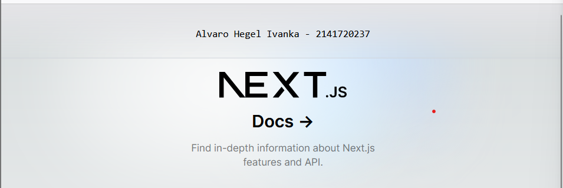
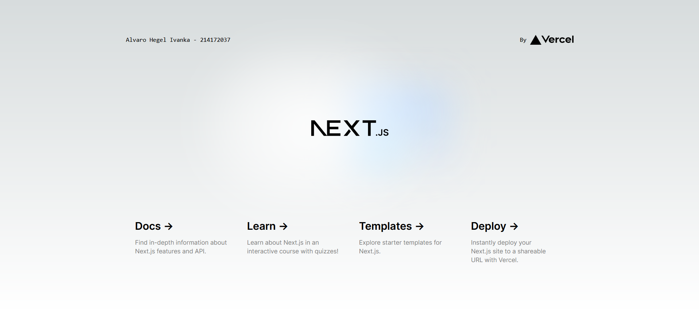
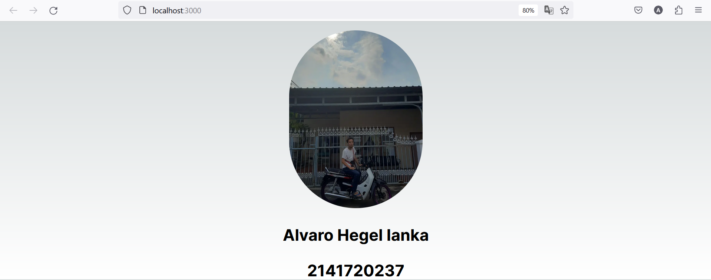

This is a [Next.js](https://nextjs.org/) project bootstrapped with [`create-next-app`](https://github.com/vercel/next.js/tree/canary/packages/create-next-app).

## Getting Started

First, run the development server:

```bash
npm run dev
# or
yarn dev
# or
pnpm dev
# or
bun dev
```

Open [http://localhost:3000](http://localhost:3000) with your browser to see the result.

You can start editing the page by modifying `app/page.tsx`. The page auto-updates as you edit the file.

This project uses [`next/font`](https://nextjs.org/docs/basic-features/font-optimization) to automatically optimize and load Inter, a custom Google Font.

## Laporan Praktikum

|  | Pemrograman Berbasis Framework 2024 |
|--|--|
| NIM | 2141720237|
| Nama |  Alvaro Hegel Ivanka |
| Kelas | TI - 3A |

### Soal 1
Pada gambar tersebut, silakan Anda browsing apa yang dimaksud dengan:TypeScript ,ESLint ,Tailwind CSS ,App Router ,Import alias

### Jawaban Soal 1
TypeScript adalah bahasa pemrograman berbasis JavaScript yang menambahkan fitur strong-typing & konsep pemrograman OOP klasik ( class, interface)

ESLint adalah sebuah tools untuk melakukan static analyzes kode kita agar kita tau dengan cepat menemukan masalah atau potensi bug dari kode yang sudah kita buat.

Tailwind CSS adalah utility-first framework CSS yang didesain untuk mempermudah dan mempercepat pembuatan aplikasi menggunakan desain custom.

App router adalah untuk memperkenalkan model baru untuk membangun aplikasi 

Import Alias adalah tempat Anda melakukan impor standar, namun alih-alih menggunakan nama yang telah ditentukan sebelumnya oleh modul pengekspor, Anda menggunakan nama yang ditentukan dalam modul pengimpor.

### Soal 2
Pada struktur project tersebut, jelaskan kegunaan folder dan file masing-masing tersebut!

### Jawaban Soal 2
Folder "node_modules": Folder ini biasanya berisi semua dependensi atau modul yang digunakan dalam proyek. Modul-modul ini dapat dikonfigurasi dan diinstal menggunakan file "package.json" dan "package-lock.json".

Folder "public": Folder ini berisi file-file yang dapat diakses secara publik oleh pengguna. File-file seperti gambar, file CSS, atau file JavaScript yang akan digunakan secara langsung oleh aplikasi web.

Folder "src": Folder ini berisi semua file JavaScript atau file sumber lainnya yang digunakan dalam proyek. File-file ini adalah bagian inti dari aplikasi atau website yang sedang dikembangkan.

Folder "static": Folder ini berisi file-file statis yang akan digunakan dalam proyek, seperti gambar, video, atau file lainnya yang tidak akan mengalami perubahan saat aplikasi berjalan.

File "tailwind.config.js": File ini adalah file konfigurasi untuk Tailwind CSS, sebuah framework CSS yang digunakan untuk mempermudah pengembangan antarmuka.

File "package.json": File ini adalah file konfigurasi untuk proyek Node.js. Ini berisi informasi tentang proyek, dependensi yang diperlukan, skrip yang akan dijalankan, dan lain-lain.

File "package-lock.json": File ini adalah file yang dihasilkan oleh Node.js saat melakukan instalasi dependensi. Ini memastikan bahwa versi dependensi yang sama digunakan oleh semua pengembang yang bekerja pada proyek tersebut.

File "README.md": File ini adalah file teks yang berisi dokumentasi tentang proyek. Biasanya berisi informasi tentang cara menginstal, menjalankan, dan menggunakan proyek.

Setiap folder dan file dalam struktur proyek memiliki peran dan kegunaan yang spesifik untuk membantu dalam pengembangan dan pengelolaan proyek.

### Soal 3
Gantilah teks pada bagian atas dengan Nama - NIM Anda. 

### Jawaban Soal 3



### Soal 4
Buatlah komponen MyTextNimName() berdasarkan kode dari soal nomor 3 sebelumnya. Lalu panggillah komponen tersebut. Apakah ada perubahan tampilan ? Mengapa demikian ?

### Jawaban Soal 4



Tidak ada perubahan 

### Soal 5
Buatlah komponen MyPage() berdasarkan project praktikum 1 ini yang berisi kode-kode HTML dari fungsi Home(). Lalu panggillah komponen tersebut. Apakah ada perubahan tampilan ? Mengapa demikian ?

### Jawaban Soal 5


Tidak ada perubahan pada kode tersebut

### Soal 6
Gunakanlah Kode JSX image tersebut, ganti dengan NIM, Nama Anda beserta link gambar ganti dengan foto Anda (bisa dari link medsos atau lainnya). Push codenya dan screenshot hasilnya.

### Jawaban Soal 6

